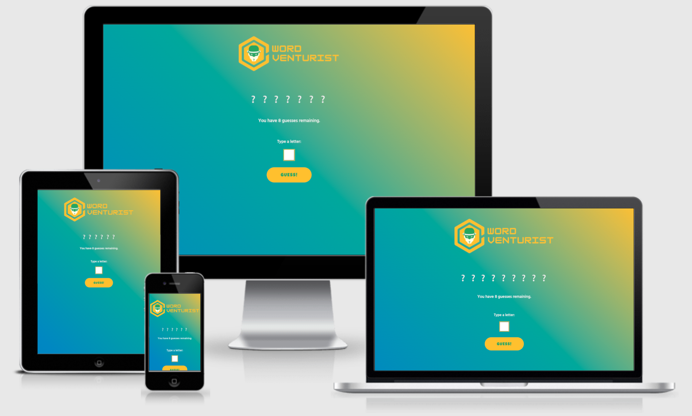
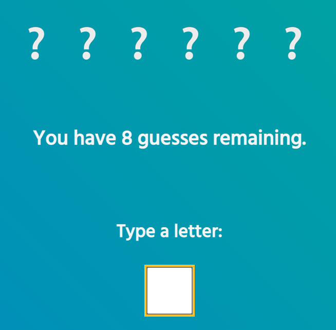
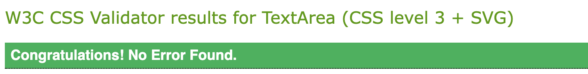
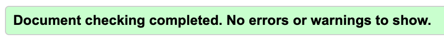
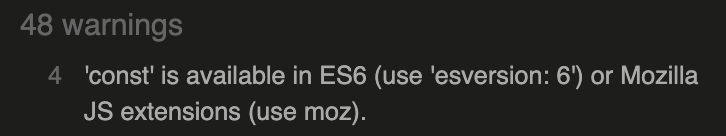
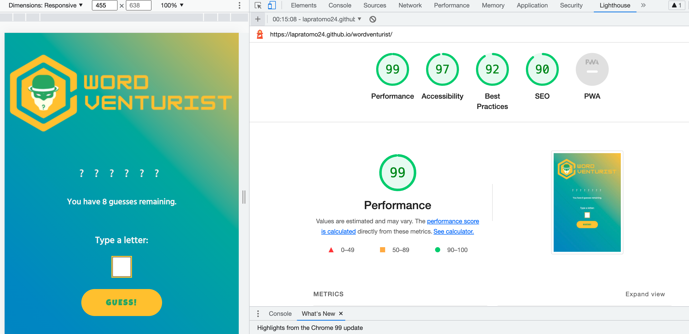

# Word Venturist

Welcome to the minigame Word Venturist!

Word Venturist is a simple guess-the-word minigame whereby a user can try and guess a word that is hidden behind each question mark, one letter at a time. 

The creation of this minigame is intended to showcase the application of JavaScript in a real-world context.

[Check out the minigame HERE!](https://lapratomo24.github.io/wordventurist/)

## Structure & Design

The minigame is presented on a single page which is fully responsive across all screen sizes.

The logo is created on Canva. The color scheme consists of three main colors, namely Amaranth #9F2B68, Golden Yellow #FFC000, and Whitesmoke. 

Google Font's Hind font is applied to the body of the page. Bungee Shade font is used for every guessed letter behind each question mark, while Luckiest Guy font is used for the text on both Guess and Restart buttons respectively.

## Features

- At the top of the page the user will see the aforementioned Word Venturist logo.

- Just under the logo, the amount of displayed question marks represents the initial word hidden behind them for which the user has to guess using the letter input. The words will be randomly fetched from a .txt file I created each time the user restarts the minigame.

- The squared box is where the user will input his or her chosen letter to guess the word behind the question marks.

- During the gameplay, some messages will appear to monitor the user's progress. As seen in the image above, one message visible from start to end counts and monitors the remaining guesses the user has until it turns zero. Other messages will pop up just above the question marks which will indicate a correct guess, an incorrect guess, a blank input, a warning to not input a number or a symbol, as well as to remind the user not to input a letter that has already been picked before. Any letter selected will also be displayed just above the input box.

- The user can click the Guess button for each attempt at guessing the word. 

- Two types of message, each accompanied with a .gif image, will be displayed as shown below.

- And last but not least, the user will see a Restart Game button which replaces the Guess button whenever he or she wins or loses the minigame.

## Testing

### Manual 
- Verified that the minigame is fully responsive on all screen sizes.
- Verified that the images used are not pixelated.
- Verified that that are no spelling mistakes on the page.
- Verified that the guess and restart buttons are working as intended.
- Verified that the squared box can be used for letter input as intended.
- Verified that the .gif images will be displayed at the end of each attempt at guessing the word.
- Verified that all messages will be displayed during the course of the minigame.

### Code Validation

Word Venturist has been officially validated through W3C Validators for both HTML and CSS, while JSHint checks the validity of JavaScript.

- HTML Validation

 

- CSS Validation

 

- JavaScript Validation: JSHint returns 48 harmless warnings similar to the warning shown below.

### Further Testing

[Webaim](https://wave.webaim.org/), [Developer Tools](https://developer.chrome.com/docs/devtools/), as well as [Lighthouse](https://developers.google.com/web/tools/lighthouse) were used to test the performance, accessibility, best practices, and Search Engine Optimization purposes. The former was used primarily for debugging as well as to view the responsiveness of WordVenturist on various tablets and smarphones. It is also compatible on all major browsers. 

- Lighthouse Accessibility Check

 

---

Happy coding!
