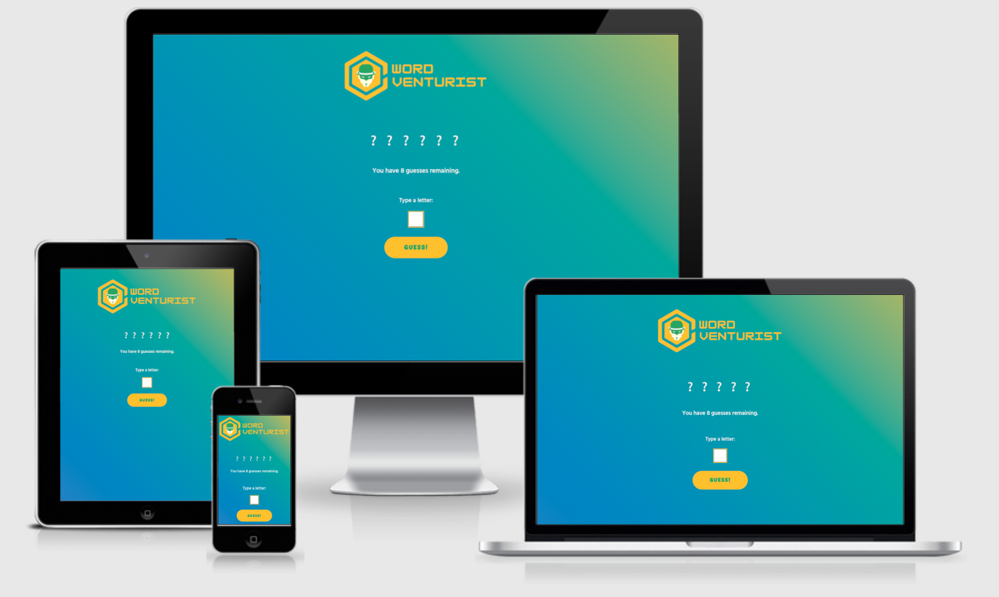
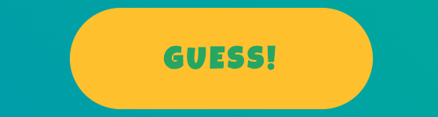
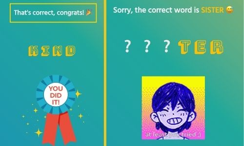

# Word Venturist

Welcome to the minigame Word Venturist!

Word Venturist is a simple guess-the-word minigame whereby a user can try and guess a word that is hidden behind each question mark, one letter at a time. 

The creation of this minigame is intended to showcase the application of JavaScript in a real-world context.

[Check out the minigame HERE!](https://lapratomo24.github.io/wordventurist/)

## Structure & Design

The minigame is presented on a single page which is fully responsive across all screen sizes.

The logo is created on Canva. The color scheme for the page consists of three main colors, namely Amaranth #9F2B68, Golden Yellow #FFC000, and Whitesmoke. 

Google Font's Hind font is applied to the body of the page. Bungee Shade font is used for every guessed letter behind each question mark, while Luckiest Guy font is used for the text on both Guess and Restart buttons respectively.

## Features

- At the top of the page the user will see the aforementioned Word Venturist logo.

- Just under the logo, the amount of displayed question marks represents the initial word hidden behind them for which the user has to guess using the letter input. The words will be randomly fetched from a .txt file I created each time the user restarts the minigame.

- The squared box is where the user will input his or her chosen letter to guess the word behind the question marks.

- During the gameplay, some messages will appear to monitor the user's progress. As seen in the image above, one message visible from start to end counts and monitors the remaining guesses the user has until it runs out. Other messages will pop up just above the question marks which will indicate a correct guess, an incorrect guess, a blank input, a warning to not input a number or a symbol, and another warning to remind the user not to input a letter that has already been picked before. Any letter selected will also be displayed between the question marks and the remaining guesses message.

- The user can click the Guess button for each attempt at guessing the word. 

- Two types of message, each accompanied with a .gif image, will be displayed as shown below whenever the user wins or loses at the end.

- And last but not least, the user will see a Restart Game button which replaces the Guess button whenever the user runs out of attempts after winning or losing at the end. 

## Technologies

- HTML5 - Provides the content and structure of Word Venturist.
- CSS3 - Provides the styling for Word Venturist.
- JavaScript - Provides interactivity for Word Venturist.
- Gitpod - An integrated development environment to create and develop projects from scratch.
- Github - Provides storage for codes and acts as a host to deploy live projects.
- GoogleFonts - Provides chosen fonts for Word Venturist.
- Canva - Used to create Word Venturist logo and partners' icons.
- Emojipedia - Provides all emojis used on Word Venturist.
- Toner - Provides all gif images used on Word Venturist.
- AmIResponsive - Generates website mockup to check Word Venturist's responsiveness.
- ChromeDevTools - Used for debugging purposes.
- W3C-HTML - HTML validation service.
- W3C-CSS - CSS validation service.
- JSHint - JavaScript validation service.
- Webformatter - Used for proper code indentation.

## Testing

### Manual 
- Verified that the minigame is fully responsive on all screen sizes.
- Verified that the images used are not pixelated.
- Verified that that are no spelling mistakes on the page.
- Verified that the guess and restart buttons are working as intended.
- Verified that the squared box can be used for letter input as intended.
- Verified that the .gif images will be displayed at the end of each attempt at guessing the word.
- Verified that all messages will be displayed during the course of the minigame.

### Code Validation

Word Venturist has been officially validated through W3C Validators for both HTML and CSS, while JSHint checks the validity of JavaScript.

- HTML Validation

 

- CSS Validation

 

- JavaScript Validation: JSHint returns 48 harmless warnings similar to the warning shown below.

### Further Testing

[Webaim](https://wave.webaim.org/), [Developer Tools](https://developer.chrome.com/docs/devtools/), as well as [Lighthouse](https://developers.google.com/web/tools/lighthouse) were used to test the performance, accessibility, best practices, and Search Engine Optimization purposes. The former was used primarily for debugging as well as to view the responsiveness of WordVenturist on various tablets and smarphones. It is also compatible on all major browsers. 

- Lighthouse Accessibility Check

 

## Deployment

### GitHub Pages

Word Venturist as the second milestone project was deployed to GitHub pages with the following steps:

1. Navigate to the 'Settings' tab in the GitHub repository.
2. Navigate to the Pages tab on the left sidebar and click it.
3. Select 'main branch' from the dropdown menu.
4. Once selected, the page should automatically refresh with a detailed ribbon display to indicate successful deployment.

### Forking the Repository

Forking is used to create a copy of a repository, where it can be viewed and edited without affecting the original repository. This can be done through the following steps:

1. Locate the repository.
2. Locate the 'Fork' button on the right side of the page. Clicking the button results in the creation of a copy of the repository.
3. The copy is now found in your GitHub account.

### Cloning the Repository

1. Locate the repository.
2. Click the 'Code' button to the left of the green 'Gitpod' button.
3. Copy the link under HTTPS by clicking the clipboard icon.
4. Open Git Bash.
5. Change the current working directory to the location where you want the cloned directory to be made.
6. Type git clone and then paste the copied link form GitHub.
7. Pressing 'Enter' will result in the creation of the local clone.

## Credits

### Code

- The website [MDN](https://developer.mozilla.org/en-US/) was used as a guidance on how to write JavaScript code.
- Code Institute's own Love Math project was also used as a reference.
- Special credit is to be given to [Skillcrush](https://skillcrush.com/), another coding bootcamp which I took part in a few years ago but never finished as I lost my motivation back then. I can still access my lessons which makes it a bit easier to restart learning JS, as personally it is impossible for me to understand JS from only a single source or two.

### Content

- Emojis were taken from [Emojipedia](https://emojipedia.org/).
- Gif images were taken from [Tenor](https://tenor.com/).
- Word Venturist logo was created on [Canva](https://www.canva.com/).
- The fonts used were generated from [GoogleFonts](https://www.fonts.google.com/).
- The patterned background was taken from [Arcadia](https://2020presidentsreport.arcadia.edu/hd-pattern-png-transparent-triangle-transparent-png-image-pattern-transparent-2048_1024/)
- The website [HTMLColorCodes](https://htmlcolorcodes.com/) was used as a reference to determine color combination.
- The website [MyColor.Space](https://mycolor.space/) was used as a reference to determine animated gradient background.

### Acknowledgments

I would like to thank my mentor [Akshat Garg](https://www.linkedin.com/in/akshatnitd/) for his support throughout my second milestone project, especially due to the fact that I still have difficulties to refactor JS code to make it clearer and cleaner for others to read. I also give my thanks to Code Institute for the prototype project Love Math. And lastly, I am grateful to the Slack Community for the helpful review of my website.

See you in the third milestone project!

---

Happy coding!
